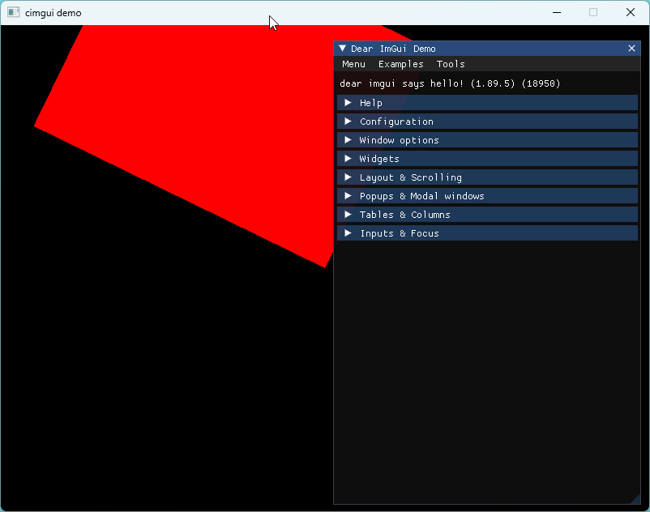

# cimgui-rs

## Motivation

This was made as an practice sample how the FFI bindings are built (more about this under libcimgui-sys).
As the imgui now includes support for SDL2 backend which does not explicitly require OpenGL3 or whatever
so the imgui-rs crate didn't really fit into the goals of this project.

Cimgui is required to compile with the experimental/sdl-renderer branch as it contains the necessary configurations
to link against SDL2. It is important to make sure that rust-sdl2 does not build against a different SDL2 compared
to libcimgui-sys.

The project sample requires a lot of unsafe blocks as it directly calls the ffi. Things to do in the future.

## Build

* Make sure the SDL2 are found from the rust lib folders (see the rust-sdl2 doc).
* Change the **build.rs** to find correctly libraries necessary for the build.
  * _root/libs/libcimgui-sys/build.rs_
  * _root/build.rs_
* Build the libcimgui-sys dependencies.
  * This requires to configure the project, and build it.
* Generate the bindings if necessary for the libcimgui-sys
* Build the crate

## TODO

* ~~Rust friendly structures over the FFI~~
* Make powershell script to download and install SDL2
  * Use the _cargo rustc -- --print sysroot_ to get the path where to put libs
